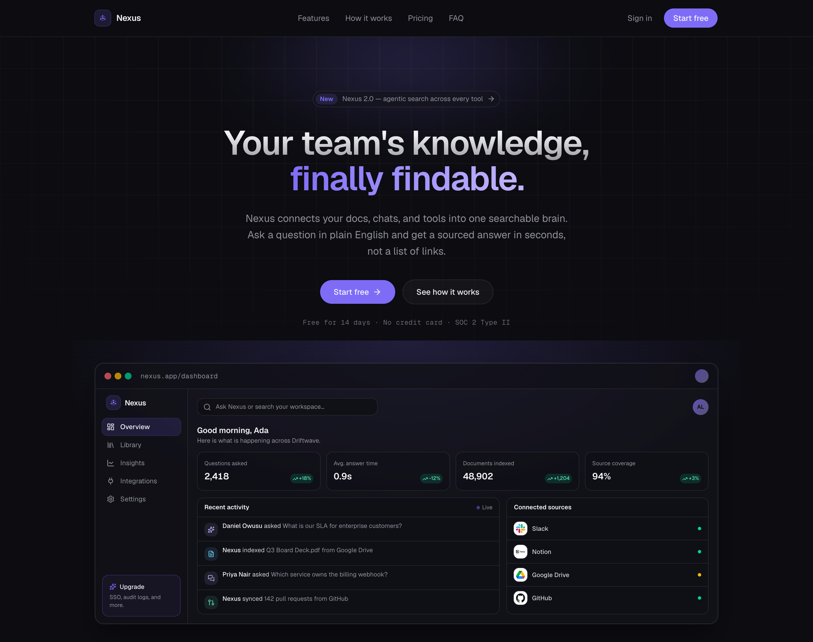
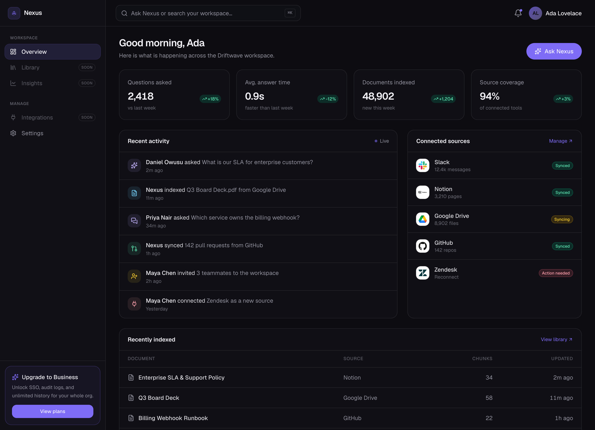
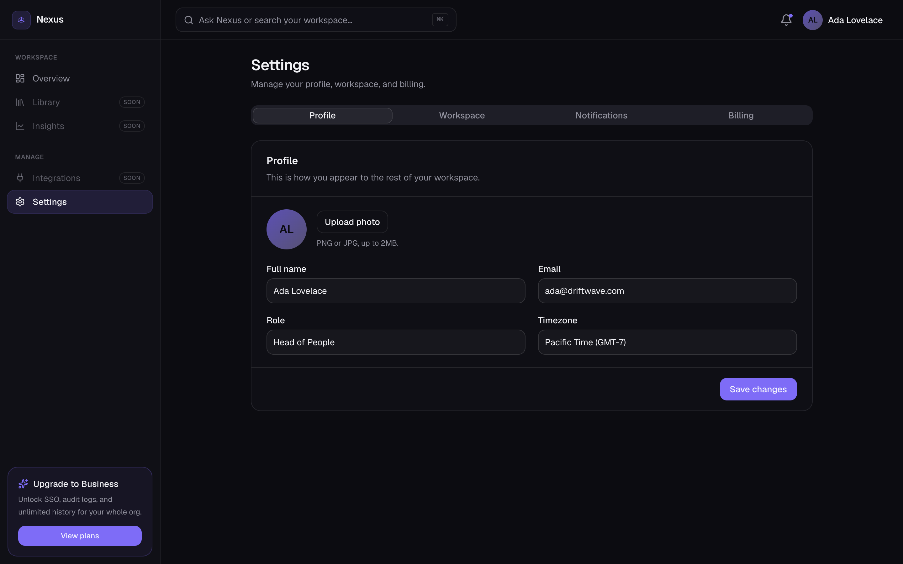
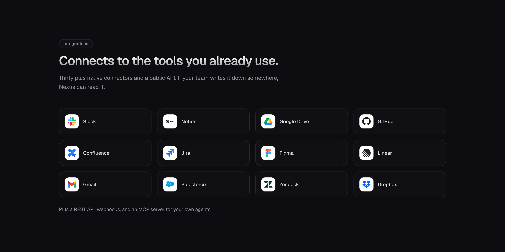

<div align="center">

# Nexus

### AI knowledge management for teams

Nexus connects your docs, chats, and tools into one searchable brain. Ask a question in plain English and get a sourced answer in seconds, not a list of links.


</div>



## Overview

Nexus is a full product surface built as a single Next.js app: a marketing landing page, authentication, and a working dashboard. It is dark themed, fully responsive, and every section uses realistic copy. There is no Lorem Ipsum anywhere.

The marketing pages prerender as static content. The dashboard runs on realistic mock data so the whole flow, from landing to sign up to the workspace, is clickable end to end.

## The product

The dashboard is the heart of the app: a grouped sidebar, a search-first topbar, overview stats with trends, a live activity feed, connected sources with sync status, and a tabbed settings area.

<table>
  <tr>
    <td width="50%" valign="top">
      
      <p align="center"><sub><b>Dashboard.</b> Stats, live activity, and connected sources.</sub></p>
    </td>
    <td width="50%" valign="top">
      
      <p align="center"><sub><b>Settings.</b> Profile, workspace, notifications, and billing.</sub></p>
    </td>
  </tr>
</table>



## Highlights

- **A real dashboard.** Grouped sidebar with active state and a collapsible mobile drawer, a search topbar with a user menu, stat cards with trend deltas, a live activity feed, connected sources with sync status, and a recently indexed table.
- **Tabbed settings.** Profile, Workspace, Notifications, and Billing, with toggles and a payment card.
- **Working auth.** Split screen sign in and sign up with OAuth buttons, inline validation, plan aware deep linking from the pricing cards, and a flow that routes you into the dashboard.
- **Real integration logos.** Slack, Notion, Google Drive, GitHub, Confluence, Jira, Figma, Linear, Gmail, Salesforce, Zendesk, and Dropbox, served locally.
- **A landing page that shows the product.** The hero leads with the actual dashboard, reusing the same data as the live app so the two never drift apart.
- **Considered and accessible.** Real buttons, keyboard friendly menus, and motion that respects `prefers-reduced-motion`.

## Tech stack

- [Next.js 16](https://nextjs.org) with the App Router and Turbopack
- React 19 and TypeScript 5
- Tailwind CSS v4
- [shadcn/ui](https://ui.shadcn.com) on Base UI (Button, Card, Badge, Avatar, Tabs, Switch, Dropdown Menu, Accordion, Input, Label)
- [lucide-react](https://lucide.dev) icons

## Getting started

```bash
npm install
npm run dev      # http://localhost:4319
```

Other scripts:

```bash
npm run build    # production build and type check
npm run lint     # eslint
npm start        # serve the production build on http://localhost:4319
```

> The dev and start servers are pinned to port 4319. Port 3000 is intentionally avoided.

## Routes

| Route | Rendering | Description |
| --- | --- | --- |
| `/` | Static | Landing page: hero with the dashboard preview, features, how it works, integrations, stats, testimonials, pricing, FAQ, and CTA |
| `/sign-in` | Static | Split screen sign in with email or OAuth |
| `/sign-up` | Dynamic | Sign up, reads `?plan=free\|team\|enterprise`; submitting routes to the dashboard |
| `/dashboard` | Static | Overview: stat cards with trends, live activity feed, connected sources, and a recently indexed table |
| `/dashboard/settings` | Static | Tabbed settings: Profile, Workspace, Notifications, and Billing |

## Structure

```
src/
  app/
    layout.tsx                 # fonts, metadata, dark theme
    globals.css                # design tokens, keyframes, utilities
    page.tsx                   # landing page
    sign-in/, sign-up/         # auth routes
    dashboard/
      layout.tsx               # sidebar + topbar shell
      page.tsx                 # overview
      settings/page.tsx        # settings
  components/
    logo.tsx, reveal.tsx, count-up.tsx
    ui/                        # shadcn primitives + section helpers
    sections/                  # landing page sections
    auth/                      # auth shell, forms, shared auth UI
    dashboard/                 # sidebar, topbar, shell
  lib/
    dashboard-data.ts          # mock workspace data
public/
  logos/                       # locally served integration logos
docs/
  screenshots/                 # README images
```

## Theming

The palette lives as CSS variables in [`src/app/globals.css`](src/app/globals.css). The accent is a single `--brand` token exposed to Tailwind as `bg-brand`, `text-brand`, and so on. Change that one value to reskin the app. The product is dark only by design.

## Notes

The auth forms and dashboard run on realistic mock data. They validate input and demonstrate the full flow, but they do not call a backend. The integration logos are the trademarks of their respective owners and are shown for illustrative "works with" purposes; replace any by dropping a new file into `public/logos/`.

## License

[MIT](LICENSE)
